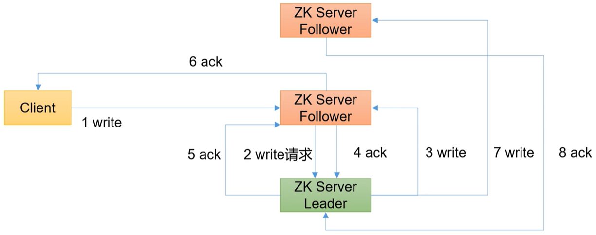

# ZooKeeper
是一個開源的，為分散式框架提供協調服務的 Apache 專案。
## 簡介
工作機制：從設計模式角度來理解，ZooKeeper是一個基於觀察者模式設計的分散式服務管理框架，它負責儲存和管理大家都關心的數據，然後接受觀察者的註冊；一旦這些資料的狀態發生變化，ZooKeeper將負責通知已經在ZooKeeper上註冊的那些觀察者並做出相應的反應。
ZooKeeper可以說是文件系統+通知機制。

特點

1. 一個領導者（Leader），與多個跟隨者（Follower）組成的集群。
2. 集群中只要有半數以上節點存活，ZooKeeper集群就能正常服務。所以ZooKeeper適合安裝奇數台伺服器。
3. 全域資料一致：每個Server保存一份相同的資料副本，Client無論連接到哪個Server，資料都是一致的。
4. 更新請求順序執行：來自同一個Client的更新請求依其發送順序依序執行。
5. 資料更新原子性：一次資料更新要麼成功，要麼失敗。
6. 即時性：在一定時間範圍內，Client能讀到最新數據。

資料結構
ZooKeeper 資料模型的結構與Unix 檔案系統很類似，整體上可以看作是一棵樹，每個節點稱做一個ZNode。每一個ZNode 預設能夠儲存1MB 的數據，每個ZNode 都可以透過其路徑做唯一識別。


應用場景
* 統一命名服務：在分散式環境下，經常需要對應用服務進行統一命名，以便於辨識。例如：IP不容易記住，網域容易記住。
* 統一配置管理：分散式環境下，設定檔同步非常常見。組態管理可交由ZooKeeper實作，可將設定資訊寫入一個Znode，一旦Znode中的數據被修改，ZooKeeper將通知各個監聽其Znode的客戶端伺服器。
* 統一集群管理：ZooKeeper可以實現即時監控節點狀態變化，將節點資訊寫入一個ZNode、進而監聽其變化。
* 伺服器節點動態上下線：透過註冊、監聽、通知等概念實現。
* 軟負載平衡：在ZooKeeper中記錄每台伺服器的存取數，讓存取數最少的伺服器去處理最新的客戶端請求。

## 安裝
這裡使用3.5.7版本，並安裝在三個節點上。https://zookeeper.apache.org/
1. 確認安裝JDK。
2. 複製安裝包並解壓到/opt/module/目錄下。`tar -zxvf apache-zookeeper-3.5.7-bin.tar.gz -C /opt/module/`
3. 修改目錄名稱
```shell=
cd /opt/module
mv apache-zookeeper-3.5.7-bin zookeeper-3.5.7
```
4. 配置服務器編號
```shell=
mkdir /opt/module/zookeeper-3.5.7/zkData
vim /opt/module/zookeeper-3.5.7/zkData/myid

#在文件中添加對應編號1-3
```
5. 配置zoo.cfg文件
```shell=
cd /opt/module/zookeeper-3.5.7/conf
mv zoo_sample.cfg zoo.cfg
vim zoo.cfg

#修改資料儲存路徑配置，預設的tmp目錄，容易被Linux系統定期刪除，所以一般不用預設的tmp目錄
dataDir=/opt/module/zookeeper-3.5.7/zkData
#添加以下
server.1=node1:2888:3888
server.2=node2:2888:3888
server.3=node3:2888:3888

#配置參數解讀
#server.A=B:C:D
#A 是一個數字，表示這個是第幾號伺服器；集群模式下設定一個檔案myid，這個檔案在dataDir 目錄下，這個檔案裡面有一個數據就是A 的值，ZooKeeper 啟動時讀取此文件，拿到裡面的資料與zoo.cfg 裡面的設定資訊比較從而判斷到底是哪個server
#B 是這個伺服器的位址
#C 是這個伺服器Follower 與集群中的Leader 伺服器交換資訊的連接埠
#D 是萬一集群中的Leader 伺服器掛了，需要一個連接埠來重新進行選舉，選出一個新的Leader，而這個連接埠就是用來執行選舉時伺服器相互通訊的連接埠

#其他參數解釋
#tickTime = 2000：通訊心跳時間，ZooKeeper伺服器與客戶端心跳時間，單位毫秒
#initLimit = 10：LF初始通訊時限，Leader和Follower初始連結時能容忍的最多心跳數（tickTime的數量）
#syncLimit = 5：LF同步通訊時限，Leader和Follower之間通信時間如果超過syncLimit * tickTime，Leader認為Follwer死掉，從伺服器清單中刪除Follower
#clientPort = 2181：客戶端連線端口，通常不做修改
```
6. 啟動ZooKeeper
```shell=
cd /opt/module/zookeeper-3.5.7/bin
./zkServer.sh start

#查看進程是否啟動，會有一個QuorumPeerMain
jps
#查看狀態
./zkServer.sh status
#啟動客戶端，若後面不接-server 則是連接localhost
./zkCli.sh
#退出客戶端
quit
#停止
zkServer.sh stop
```
建立腳本來執行ZK集群啟動停止
1. 創建腳本
```shell=
cd ~
mkdir zk
vim zk/zk.sh

#貼上以下
#!/bin/bash
case $1 in
"start")
  {
    for i in node1 node2 node3
    do
      echo "---------- zookeeper $i 啟動 ------------"
      ssh $i "/opt/module/zookeeper-3.5.7/bin/zkServer.sh start"
    done
  }
  ;;
"stop")
  {
    for i in node1 node2 node3
    do
      echo "---------- zookeeper $i 停止 ------------"
      ssh $i "/opt/module/zookeeper-3.5.7/bin/zkServer.sh stop"
    done
  }
  ;;
"status")
  {
    for i in node1 node2 node3
    do
      echo "---------- zookeeper $i 狀態 ------------"
      ssh $i "/opt/module/zookeeper-3.5.7/bin/zkServer.sh status"
    done
  }
  ;;
esac
```
2. 增加腳本執行權限`chmod 777 zk/zk.sh`
3. zk集群啟動`zk/zk.sh start`
4. zk集群停止`zk/zk.sh stop`

## 選舉機制
* SID：伺服器ID。用來唯一標示一台ZooKeeper集群中的機器，每台機器不能重複，和myid一致。
* ZXID：事務ID。用來標識一次伺服器狀態的變更。在某一時刻，集群中的每台機器的ZXID值不一定完全一致，這和ZooKeeper伺服器對於客戶端「更新請求」的處理邏輯有關。
* Epoch：每個Leader任期的代號。沒有Leader時同一輪投票過程中的邏輯時鐘值是相同的。每投完一次票這個數據就會增加。
### 第一次啟動


1. 伺服器1啟動，發起一次選舉。伺服器1投自己一票。此時服務器1票數一票，不夠半數以上（3票），選舉無法完成，伺服器1狀態保持為LOOKING
2. 伺服器2啟動，再發起一次選舉。伺服器1和2分別投自己一票並交換選票資訊；此時伺服器1發現伺服器2的myid比自己目前投票推舉的（伺服器1）大，更改選票為推舉伺服器2。此時伺服器1票數0票，伺服器2票數2票，沒有半數以上結果，選舉無法完成，伺服器1與伺服器2狀態維持LOOKING
3. 伺服器3啟動，發起一次選舉。此時伺服器1和2都會更改選票為伺服器3。此投票結果為伺服器1為0票，伺服器2為0票，伺服器3為3票。此時服務器3的票數已經超過半數，伺服器3當選Leader。伺服器1，2更改狀態為FOLLOWING，伺服器3更改狀態為LEADING
4. 伺服器4啟動，發起一次選舉。此時伺服器1，2，3已經不是LOOKING狀態，不會更改選票資訊。交換選票資訊結果、伺服器3為3票，伺服器4為1票。此時伺服器4服從多數，更改選票資訊為伺服器3，更改狀態為FOLLOWING
5. 伺服器5啟動，同4一樣當小弟

### 非第一次啟動


1. 當ZooKeeper集群中的一台伺服器出現以下兩種情況之一時，就會開始進入Leader選舉：
    * 伺服器初始化啟動
    * 伺服器運作期間無法和Leader保持連線。
2. 而當一台機器進入Leader選舉流程時，目前集群也可能處於以下兩種狀態：
    * 集群中本來就已經存在一個Leader。對於這種情況，機器試圖去選舉Leader時，會被告知當前伺服器的Leader訊息，對於該機器來說，僅僅需要和Leader機器建立連接，並進行狀態同步即可。
    * 集群中不存在Leader。假設ZooKeeper由5台伺服器組成，SID分別為1、2、3、4、5，ZXID分別為8、8、8、7、7，且此時SID為3的伺服器是Leader。某一時刻，3和5伺服器發生故障，因此開始進行Leader選舉。SID為1、2、4的機器投票情況（EPOCH，ZXID，SID ）：（1，8，1）、（1，8，2）、（1，7，4）。選舉Leader規則：EPOCH大的直接勝出 > EPOCH相同，事務id大的勝出 > 事務id相同，伺服器id大的勝出。

## 客戶端操作
客戶端向服務端寫入資料流程
發送給Leader

發送給Follower


命令行基本語法
* help：顯示所有操作命令
* ls path：使用ls 指令來查看目前znode 的子節點[可監聽]
    * -w 監聽子節點變化
    * -s 附加次級資訊
* create：普通創建
    * -s 含有序列
    * -e 臨時（重啟或超時消失）
* get path：獲得節點的值[可監聽]
    * -w 監聽節點內容變化
    * -s 附加次級訊息
* set：設定節點的具體值
* stat：檢視節點狀態
* delete：刪除節點
* deleteall：遞歸刪除節點

### 節點類型
* 短暫（Ephemeral）：客戶端和伺服器端斷開連線後，建立的節點自行刪除
* 持久性（Persistent）：客戶端和伺服器端斷開連線後，建立的節點不刪除

建立znode時設定順序標識，znode名稱之後會附加一個值，順序號是一個單調遞增的計數器，由父節點維護。
注意：在分散式系統中，順序號可以被用於為所有的事件進行全域排序，這樣客戶端可以通過順序號推斷事件的順序。

1. 持久化目錄節點：客戶端與ZooKeeper斷開連線後，該節點依舊存在
2. 持久化順序編號目錄節點：用戶端與ZooKeeper斷開連線後，該節點依舊存在，只是ZooKeeper給該節點名稱進行順序編號
3. 臨時目錄節點：客戶端與ZooKeeper斷開連線後，該節點被刪除
4. 臨時順序編號目錄節點：客戶端與ZooKeeper 斷開連線後，該節點被刪除，只是ZooKeeper給該節點名稱進行順序編號


實作
1. 啟動客戶端`zkCli.sh -server`，連接node1`zkCli.sh -server node1:2181`
2. 查看當前節點詳細數據`ls -s /`
```shell=
cZxid = 0x0
ctime = Wed Dec 31 16:00:00 PST 1969
mZxid = 0x0
mtime = Wed Dec 31 16:00:00 PST 1969
pZxid = 0x0
cversion = -1
dataVersion = 0
aclVersion = 0
ephemeralOwner = 0x0
dataLength = 0
numChildren = 1
```
cZxid：建立節點的事務zxid。每次修改ZooKeeper 狀態都會產生一個事務ID，是ZooKeeper 中所有修改總的次序。如果zxid1 小於zxid2，那麼zxid1 在zxid2 之前發生。
ctime：znode 被創建的毫秒數（從19xx 年開始）
mZxid：znode 最後更新的事務zxid
mtime：znode 最後修改的毫秒數（從19xx 年開始）
pZxid：znode 最後更新的子節點zxid
cversion：znode 子節點變化號，znode 子節點修改次數
dataVersion：znode 資料變化號
aclVersion：znode 存取控制清單的變化號
ephemeralOwner：如果是臨時節點，這個是znode 擁有者的session id。如果不是臨時節點則是0
dataLength：znode 的資料長度
numChildren：znode 子節點數量

3. 建立2個普通節點（永久節點+不帶序號）
```shell=
create /sanguo "diaochan"
create /sanguo/shuguo "liubei"
#注意：建立節點時，要賦值
ls /
ls /sanguo
```
4. 獲得節點的值
```shell=
get -s /sanguo
get -s /sanguo/shuguo
```
5. 建立帶有序號的節點（永久節點+帶序號）
```shell=
#先創建一個普通的根節點
create /sanguo/weiguo "caocao"
#建立帶有序號的節點
create -s /sanguo/weiguo/zhangliao "zhangliao"
create -s /sanguo/weiguo/zhangliao "zhangliao"

#如果原來沒有序號節點，序號從0 開始依序遞增。如果原節點下已有2 個節點，則排序時從2 開始，以此類推
```
6. 建立短暫節點（短暫節點+不帶序號or帶序號）
```shell=
#建立短暫的不帶序號的節點
create -e /sanguo/wuguo "zhouyu"
#建立短暫的帶序號的節點
create -e -s /sanguo/wuguo "zhouyu"

#在目前客戶端是能查看到的
ls /sanguo

#退出目前客戶端然後再重新啟動客戶端 
quit
zkCli.sh -server

#再次查看根目錄下短暫節點已刪除
ls /sanguo
```
7. 修改節點資料值`set /sanguo/weiguo "simayi"`

### 監聽器
客戶端註冊監聽它關心的目錄節點，當目錄節點發生變化（資料改變、節點刪除、子目錄節點增加刪除）時，ZooKeeper 會通知客戶端。


1. 首先要有一個main()線程
2. 在main執行緒中建立ZooKeeper客戶端，這時就會建立兩個線程，一個負責網路連線通訊（connet），一個負責監聽（listener）
3. 透過connect執行緒將註冊的監聽事件傳送給ZooKeeper
4. 在ZooKeeper的註冊監聽器清單中將註冊的監聽事件加入到清單中
5. ZooKeeper監聽到有資料或路徑變化，就會將這個訊息傳送給listener線程
6. listener線程內部呼叫了process()方法

常見的監聽：監聽節點資料的變化`get path [watch]`、監聽子節點增減的變化`ls path [watch]`

實作
節點的值變化監聽
1. 在node3主機上註冊監聽/sanguo 節點資料變化`get -w /sanguo`
2. 在node2 主機上修改/sanguo 節點的數據`set /sanguo "xisi"`
3. 觀察node3 主機收到資料變更的監聽
```shell=
WATCHER::

WatchedEvent state:SyncConnected type:NodeDataChanged path:/sanguo
#注意：在node2再多次修改/sanguo的值，node3上不會再收到監聽。因為註冊一次，只能監聽一次。想再次監聽，需要再次註冊。
```
節點的子節點變化監聽（路徑變化）
1. 在node3 主機上註冊監聽/sanguo 節點的子節點變化`ls -w /sanguo`
2. 在node2 主機/sanguo 節點上建立子節點`create /sanguo/jin "simayi"`
3. 觀察node3 主機收到子節點變更的監聽
```shell=
WATCHER::

WatchedEvent state:SyncConnected type:NodeChildrenChanged path:/sanguo
#注意：節點的路徑變化，也是註冊一次，生效一次。想多次生效，就需要多次註冊。
```
4. 刪除節點`delete /sanguo/jin`
5. 查看節點狀態`stat /sanguo`
6. 遞歸刪除節點`deleteall /sanguo`

### API操作
見程式碼ZkClient

## 伺服器動態上下線監聽案例
在某分散式系統中，主節點可以有多台，可以動態上下線，任一台客戶端都能即時感知到主節點伺服器的上下線。
伺服器和客戶端相對於ZooKeeper都是"客戶端"，只不過伺服器是創建節點的操作，客戶端是監聽節點的操作（一旦那個節點不存在了，下次就不去訪問這個節點了）。


1. 先在集群上建立/servers 節點`create /servers "servers"`
2. 伺服器端向ZooKeeper 註冊，見程式碼DistributeServer
3. 客戶端監聽，見程式碼DistributeClient
4. 啟動客戶端代碼DistributeClient
5. 透過node1 命令行客戶端操作增加減少伺服器
```shell=
#建立臨時帶序號節點
create -e -s /servers/machine1 "machine1"
create -e -s /servers/machine2 "machine2"

#觀察IDE控制台變化

#執行刪除操作
delete /servers/machine10000000000

#觀察IDE控制台變化
```
5. 透過IDE操作DistributeServer增加減少伺服器，以machine3來跑main()方法並觀察IDE控制台變化
6. 終止DistributeServermain()方法並觀察IDE控制台變化

## 分散式鎖定案例
什麼叫做分散式鎖呢？
比如說"進程1"使用該資源的時候，會先去獲得鎖，"進程1"獲得鎖以後會對該資源保持獨佔，這樣其他進程就無法存取該資源，"進程1"用完該資源以後就將鎖定釋放掉，讓其他進程來獲得鎖，那麼透過這個鎖機制，就能保證了分散式系統中多個進程能夠有序的存取該資源。那我們把這個分散式環境下的這個鎖叫成分散式鎖。


### 原生zk實現
見程式碼DistributedLock

### Curator框架實現
原生的Java API 開發存在的問題
1. 會話連線是異步的，需要自己去處理。例如使用CountDownLatch
2. Watch 需要重複註冊，不然就不能生效
3. 開發的複雜性相對高
4. 不支援多節點刪除和建立，需要自己去遞歸

見程式碼CuratorLock